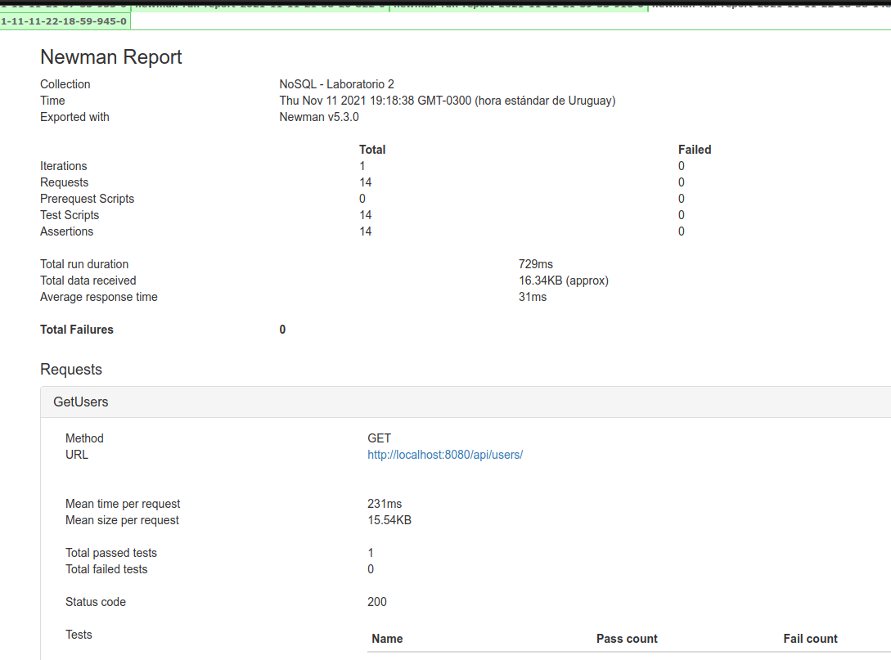

# Laboratorio 2 - Taller de Base de Datos noSQL

1. [Tecnologías](#descripción)
2. [Configuración](#configuración)
3. [Jenkins](#jenkins)
4. [Postman](#postman)

## Tecnologías
La API está construida en Java Spring Boot y los datos son guardados en una base de datos MongoDB.
La solución está dockerizada y utilizamos Jenkins para la automatización de pruebas.

## Configuración

```bash
# Instalar dependencias y generar un .jar de la aplicación
$ mvn install -DskipTests

# Generar una imagen de la aplicación de SpringBoot (este comando utiliza el Dockerfile)
$ docker build -t springboot-mongodb:1.0 .

# Verificar que se haya creado la imagen
$ docker images

# Levantar los servicios de mongo, mongo-express y spring-boot.
$ docker-compose up -d

# Verificar que los servicios se hayan iniciado
$ docker-compose ps

```
Luego de realizar esos pasos podemos entrar a [MongoExpress(GUI)](http://localhost:8081/).

## Jenkins
Para cumplir con el requerimiento opcional de utilizar la tecnología Jenkins y automatizar las pruebas realizadas a nuestro sistema se tomó la decisión de usar Postman y Newman, en conjunto con la tecnología mencionada anteriormente.

Primeramente, se realizó la implementación de una colección de pruebas en Postman asociado a los requests realizados a los distintos endpoints ofrecidos por nuestra aplicación. 

Posteriormente, se exportó la colección en formato json para luego poder ser colocada en el repositorio y poder realizar la ejecución de las pruebas desde Jenkins, utilizando Newman para generar los reportes. 



[Guía básica](https://youtu.be/3LPN8mI_s0Q) para poder realizar las configuraciones de la herramienta y algunos ejemplos sencillos.


## Postman
[Colección de requests con sus respectivos tests](./postman-tests/tests.json)